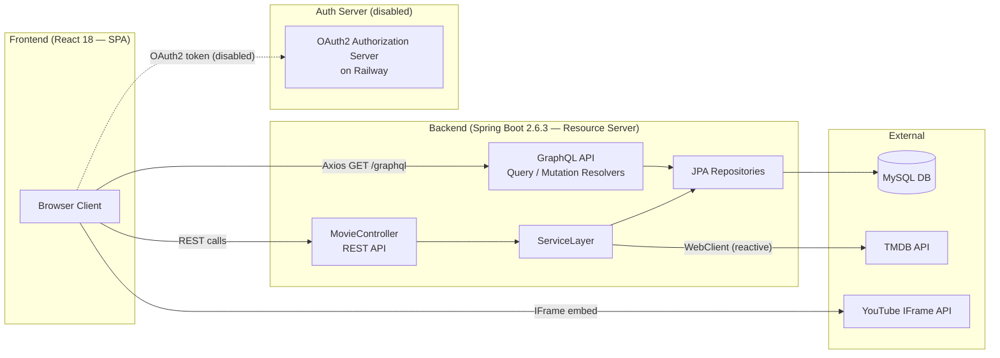
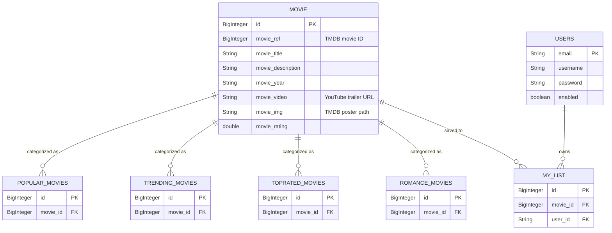
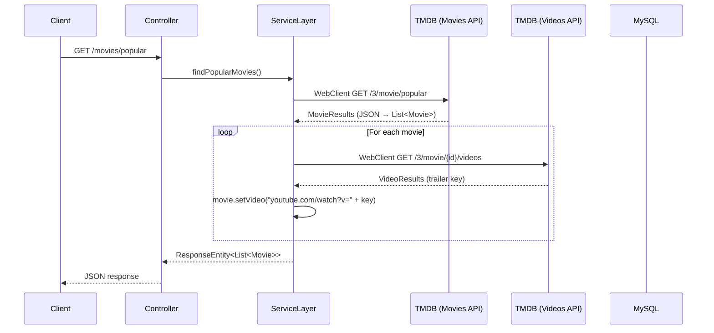
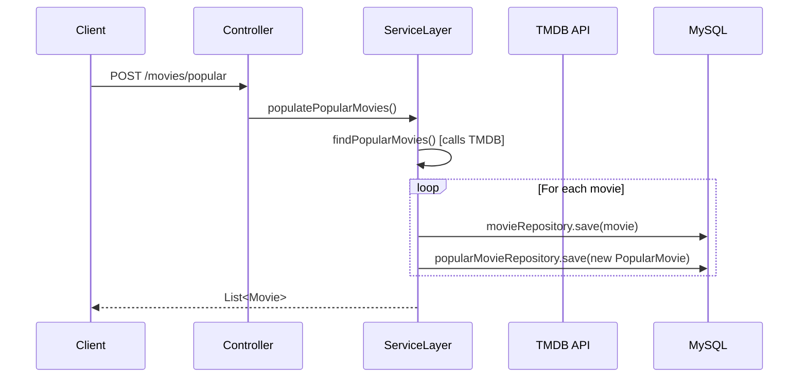
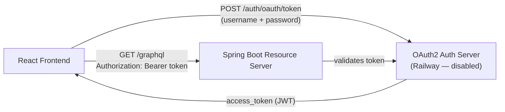

# SoloFlix — Complete Project Deep Dive (Interview Prep)

> A Netflix-clone streaming web application that fetches real movie data from **TMDB API**, caches it in **MySQL**, exposes it via **REST + GraphQL** APIs, and renders it in a **React** frontend with embedded YouTube trailers.

---

## 1. High-Level Architecture



### Key Architectural Decisions to Highlight

| Decision | Why it matters |
|---|---|
| **Dual API** (REST + GraphQL) | Shows versatility — REST for data population, GraphQL for flexible querying |
| **Reactive WebClient** over RestTemplate | Non-blocking HTTP calls to TMDB; demonstrates modern Spring paradigm |
| **Data caching in MySQL** | TMDB data is fetched once via POST endpoints, then served from DB via GraphQL — reduces external API calls |
| **Spring Profiles** (dev / prod) | Environment-specific configs; production uses env vars for secrets |
| **OAuth2 Resource Server** (designed) | Shows understanding of token-based auth even though currently mocked |

---

## 2. Backend — Technology Stack

| Technology | Version | Purpose |
|---|---|---|
| **Java** | 1.8 | Core language |
| **Spring Boot** | 2.6.3 | Application framework, auto-configuration |
| **Spring MVC** | (via starter-web) | REST controllers, `@RestController`, `@GetMapping`, `@PostMapping` |
| **Spring WebFlux** | (via starter-webflux) | `WebClient` for reactive, non-blocking HTTP calls to TMDB |
| **Spring Data JPA** | (via starter-data-jpa) | ORM layer, repository pattern, auto-generated queries |
| **GraphQL Java** | 5.0.2 | GraphQL endpoint (`/graphql`) with schema-first approach |
| **GraphiQL** | 5.0.2 | In-browser GraphQL IDE at `/graphiql` |
| **MySQL Connector/J** | 8.0.32 | JDBC driver for MySQL |
| **Spring Cloud Bootstrap** | 3.1.6 | Externalized configuration bootstrap |
| **JAXB** | 2.3.1 | XML binding (Java 8 compatibility fix) |
| **Maven** | (wrapper included) | Build tool and dependency management |

### Commented-out / Disabled Dependencies
- **Spring Cloud OAuth2** (`spring-cloud-starter-oauth2`) — was used for token validation when the auth server was active

---

## 3. Backend — Package Structure & Layered Architecture

```
com.company.streamingwebappproject
├── StreamingWebappProjectApplication.java   ← Entry point (@SpringBootApplication)
├── CorsFilter.java                          ← CORS filter (commented out — was for OAuth2)
├── controllers/
│   └── MovieController.java                 ← REST API endpoints
├── models/
│   ├── Movie.java                           ← Core JPA entity
│   ├── MovieResults.java                    ← TMDB API response wrapper
│   ├── Video.java                           ← TMDB video key model
│   ├── VideoResults.java                    ← TMDB video response wrapper
│   ├── User.java                            ← User JPA entity
│   └── sections/
│       ├── PopularMovie.java                ← Join entity (movie ↔ "popular" category)
│       ├── TrendingMovie.java               ← Join entity (movie ↔ "trending" category)
│       ├── TopRatedMovie.java               ← Join entity (movie ↔ "top rated" category)
│       ├── RomanceMovie.java                ← Join entity (movie ↔ "romance" category)
│       └── MyList.java                      ← Join entity (movie ↔ user watchlist)
├── repository/
│   ├── MovieRepository.java                 ← JpaRepository + custom search query
│   ├── PopularMovieRepository.java
│   ├── TrendingMovieRepository.java
│   ├── TopRatedMovieRepository.java
│   ├── RomanceMovieRepository.java
│   ├── MyListRepository.java               ← Custom query: findByUserEmail()
│   └── UserRepository.java                 ← Custom query: findByEmail()
├── resolvers/
│   ├── Query.java                           ← GraphQL query resolver (10+ queries)
│   └── Mutation.java                        ← GraphQL mutation resolver (user CRUD)
└── service/
    └── ServiceLayer.java                    ← Business logic + TMDB API integration
```

### Layer Responsibilities

| Layer | Role | Key Pattern |
|---|---|---|
| **Controller** | Accepts HTTP requests, delegates to service, returns responses | `@RestController`, `@CrossOrigin` |
| **Service** | Core business logic: calls TMDB API via `WebClient`, enriches movies with trailer URLs, persists to DB | `@Component`, `@Value` for config injection |
| **Repository** | Data access via Spring Data JPA auto-implemented interfaces | `JpaRepository<Entity, ID>`, derived query methods |
| **Resolvers** | GraphQL entry points — map [.graphqls](file:///c:/Users/andri/Documents/Code/Codes/Streaming-app/streaming-webapp-project/src/main/resources/graphql/movie/user.graphqls) schema operations to Java methods | `GraphQLQueryResolver`, `GraphQLMutationResolver` |

---

## 4. Data Model (JPA Entities & Relationships)



### Key Modeling Decisions

- **Category tables** (`popular_movies`, `trending_movies`, etc.) use `@ManyToOne` to [Movie](file:///c:/Users/andri/Documents/Code/Codes/Streaming-app/streaming-webapp-project/src/main/java/com/company/streamingwebappproject/models/Movie.java#10-117) — allows the same movie to appear in multiple categories
- **[MyList](file:///c:/Users/andri/Documents/Code/Codes/Streaming-app/streaming-webapp-project/src/main/java/com/company/streamingwebappproject/models/sections/MyList.java#11-57)** is a **many-to-many join table** between [User](file:///c:/Users/andri/Documents/Code/Codes/Streaming-app/streaming-webapp-project/src/main/java/com/company/streamingwebappproject/models/User.java#8-80) and [Movie](file:///c:/Users/andri/Documents/Code/Codes/Streaming-app/streaming-webapp-project/src/main/java/com/company/streamingwebappproject/models/Movie.java#10-117) — models personal watchlists
- **`@JsonProperty`** annotations on [Movie](file:///c:/Users/andri/Documents/Code/Codes/Streaming-app/streaming-webapp-project/src/main/java/com/company/streamingwebappproject/models/Movie.java#10-117) map TMDB API JSON fields (e.g., `original_title` → `title`, `poster_path` → `image`) — direct deserialization from external API
- **[getImage()](file:///c:/Users/andri/Documents/Code/Codes/Streaming-app/streaming-webapp-project/src/main/java/com/company/streamingwebappproject/models/Movie.java#88-91)** prepends the TMDB image base URL (`https://image.tmdb.org/t/p/w500`) — encapsulated URL construction

---

## 5. REST API Endpoints

| Method | Endpoint | Purpose | Returns |
|---|---|---|---|
| `GET` | `/movies/popular` | Fetch popular movies from TMDB in real-time | `List<Movie>` |
| `GET` | `/movies/trending` | Fetch trending movies from TMDB | `List<Movie>` |
| `GET` | `/movies/toprated` | Fetch top-rated movies from TMDB | `List<Movie>` |
| `GET` | `/movies/similar/{id}` | Fetch romance movies from TMDB | `List<Movie>` |
| `POST` | `/movies/popular` | Fetch from TMDB **and persist** to DB | `List<Movie>` (201) |
| `POST` | `/movies/trending` | Fetch from TMDB **and persist** to DB | `List<Movie>` (201) |
| `POST` | `/movies/toprated` | Fetch from TMDB **and persist** to DB | `List<Movie>` (201) |
| `POST` | `/movies/romance` | Fetch from TMDB **and persist** to DB | `List<Movie>` (201) |

> **Design pattern**: GET endpoints fetch live from TMDB; POST endpoints fetch **and cache** in MySQL. The frontend then reads from the DB cache via GraphQL.

---

## 6. GraphQL API

### Schema (7 [.graphqls](file:///c:/Users/andri/Documents/Code/Codes/Streaming-app/streaming-webapp-project/src/main/resources/graphql/movie/user.graphqls) files using `extend type Query` pattern)

**Queries:**

| Query | Arguments | Returns |
|---|---|---|
| [movies](file:///c:/Users/andri/Documents/Code/Codes/Streaming-app/streaming-webapp-project/src/main/java/com/company/streamingwebappproject/resolvers/Query.java#32-35) | — | `[Movie]!` |
| [findMovieByTitle](file:///c:/Users/andri/Documents/Code/Codes/Streaming-app/streaming-webapp-project/src/main/java/com/company/streamingwebappproject/resolvers/Query.java#36-39) | `title: String` | `[Movie]` |
| [findMovieById](file:///c:/Users/andri/Documents/Code/Codes/Streaming-app/streaming-webapp-project/src/main/java/com/company/streamingwebappproject/resolvers/Query.java#40-43) | `id: String` | [Movie](file:///c:/Users/andri/Documents/Code/Codes/Streaming-app/streaming-webapp-project/src/main/java/com/company/streamingwebappproject/models/Movie.java#10-117) |
| [popularMovies](file:///c:/Users/andri/Documents/Code/Codes/Streaming-app/streaming-webapp-project/src/main/java/com/company/streamingwebappproject/resolvers/Query.java#44-47) | — | `[PopularMovie]!` |
| [trendingMovies](file:///c:/Users/andri/Documents/Code/Codes/Streaming-app/streaming-webapp-project/src/main/java/com/company/streamingwebappproject/resolvers/Query.java#56-59) | — | `[TrendingMovie]!` |
| [topRatedMovies](file:///c:/Users/andri/Documents/Code/Codes/Streaming-app/streaming-webapp-project/src/main/java/com/company/streamingwebappproject/resolvers/Query.java#52-55) | — | `[TopRatedMovie]!` |
| [romanceMovies](file:///c:/Users/andri/Documents/Code/Codes/Streaming-app/streaming-webapp-project/src/main/java/com/company/streamingwebappproject/resolvers/Query.java#48-51) | — | `[RomanceMovie]!` |
| [myLists](file:///c:/Users/andri/Documents/Code/Codes/Streaming-app/streaming-webapp-project/src/main/java/com/company/streamingwebappproject/resolvers/Query.java#60-63) | — | `[MyList]!` |
| [findMyListByUserEmail](file:///c:/Users/andri/Documents/Code/Codes/Streaming-app/streaming-webapp-project/src/main/java/com/company/streamingwebappproject/resolvers/Query.java#64-67) | `email: String` | `[MyList]!` |
| [users](file:///c:/Users/andri/Documents/Code/Codes/Streaming-app/streaming-webapp-project/src/main/java/com/company/streamingwebappproject/resolvers/Query.java#68-71) | — | `[User]!` |
| [findUserByEmail](file:///c:/Users/andri/Documents/Code/Codes/Streaming-app/streaming-webapp-project/src/main/java/com/company/streamingwebappproject/resolvers/Query.java#72-75) | `email: String` | `[User]` |

**Mutations:**

| Mutation | Arguments | Returns |
|---|---|---|
| [addUser](file:///c:/Users/andri/Documents/Code/Codes/Streaming-app/streaming-webapp-project/src/main/java/com/company/streamingwebappproject/resolvers/Mutation.java#15-19) | `email, username, password, enabled` | [User](file:///c:/Users/andri/Documents/Code/Codes/Streaming-app/streaming-webapp-project/src/main/java/com/company/streamingwebappproject/models/User.java#8-80) |
| [updateUser](file:///c:/Users/andri/Documents/Code/Codes/Streaming-app/streaming-webapp-project/src/main/java/com/company/streamingwebappproject/resolvers/Mutation.java#20-24) | `email, username, password, enabled` | [User](file:///c:/Users/andri/Documents/Code/Codes/Streaming-app/streaming-webapp-project/src/main/java/com/company/streamingwebappproject/models/User.java#8-80) |
| [deleteUserByEmail](file:///c:/Users/andri/Documents/Code/Codes/Streaming-app/streaming-webapp-project/src/main/java/com/company/streamingwebappproject/resolvers/Mutation.java#25-29) | `email` | `Boolean` |

### Schema-First Design
- Each entity has its own [.graphqls](file:///c:/Users/andri/Documents/Code/Codes/Streaming-app/streaming-webapp-project/src/main/resources/graphql/movie/user.graphqls) file
- Category schemas use **`extend type Query`** to modularly add queries
- The [user.graphqls](file:///c:/Users/andri/Documents/Code/Codes/Streaming-app/streaming-webapp-project/src/main/resources/graphql/movie/user.graphqls) defines the **[Mutation](file:///c:/Users/andri/Documents/Code/Codes/Streaming-app/streaming-webapp-project/src/main/java/com/company/streamingwebappproject/resolvers/Mutation.java#9-30)** type

---

## 7. Business Logic — ServiceLayer Deep Dive

The [ServiceLayer.java](file:///c:/Users/andri/Documents/Code/Codes/Streaming-app/streaming-webapp-project/src/main/java/com/company/streamingwebappproject/service/ServiceLayer.java) is the brain of the backend:

### Flow: Fetching Movies from TMDB



### Flow: Populating the Database (Cache)



### Key Code Patterns

1. **Reactive HTTP Client** — `WebClient.create(uri).get().retrieve().bodyToMono(MovieResults.class).block()`
2. **Error handling** — Catches `WebClientResponseException` for HTTP 429 (rate limit), 4xx, 5xx
3. **Movie enrichment** — [findMovieVideo()](file:///c:/Users/andri/Documents/Code/Codes/Streaming-app/streaming-webapp-project/src/main/java/com/company/streamingwebappproject/service/ServiceLayer.java#84-109) iterates movies, fetches trailer from TMDB Videos API, sets YouTube URL
4. **Config injection** — `@Value("${tmdb.api.key}")` reads API key from properties

---

## 8. Configuration & Spring Profiles

| Profile | File | Database | API Key |
|---|---|---|---|
| `development` | [application-development.properties](file:///c:/Users/andri/Documents/Code/Codes/Streaming-app/streaming-webapp-project/src/main/resources/application-development.properties) | `localhost:3306/streaming_app_db` | Hardcoded |
| `production` | [application-production.properties](file:///c:/Users/andri/Documents/Code/Codes/Streaming-app/streaming-webapp-project/src/main/resources/application-production.properties) | `${DATASOURCE_URL}` (env var) | `${TMDB_API_KEY}` (env var) |

**Active profile** set in [application.properties](file:///c:/Users/andri/Documents/Code/Codes/Streaming-app/streaming-webapp-project/src/main/resources/application.properties): `spring.profiles.active: development`

**GraphQL config** (both profiles):
- Endpoint: `/graphql`
- GraphiQL IDE: `/graphiql`
- CORS enabled on GraphQL servlet

---

## 9. Authentication Architecture (Disabled but Explainable)



**What was implemented:**
- **OAuth2 Password Grant** flow — client sends credentials, receives JWT
- **CorsFilter** — custom servlet filter to handle CORS for OAuth endpoints (highest priority `@Order`)
- **`@EnableResourceServer`** — validated Bearer tokens on every request
- **Basic Auth header** (`aHRtbDU6YXBwX3NlY3JldA==` = `html5:app_secret`) — client credentials

**Current mock**: Login checks hardcoded credentials (`plainUser@gmail.com` / `password`), stores a dummy token in `localStorage`

---

## 10. Frontend — Technology Stack

| Technology | Version | Purpose |
|---|---|---|
| **React** | 18.2.0 | UI framework (functional components + hooks) |
| **React Router DOM** | 6.10.0 | Client-side routing (`/`, `/login`, `/mylist`) |
| **Axios** | 1.3.4 | HTTP client for GraphQL queries |
| **Ant Design** | 5.4.0 | UI components (Form, Input, Button, Modal, Checkbox) |
| **React Bootstrap** | 2.7.2 | Navbar, Container, NavDropdown |
| **Bootstrap** | 5.2.3 | CSS framework for grid/utilities |
| **React Slick** + **Slick Carousel** | 0.29.0 / 1.8.1 | Horizontal movie poster carousels |
| **React YouTube** | 10.1.0 | YouTube player component in modals |
| **YouTube IFrame API** | (CDN) | Full-screen hero video player with intersection observer |

---

## 11. Frontend — Component Architecture

```
src/
├── App.js                    ← Router setup (3 routes)
├── components/
│   ├── Login.js              ← Auth form (Ant Design Form + validation)
│   ├── Logout.js             ← Clears localStorage, redirects to /login
│   ├── MainPage.js           ← Main view: hero video + 4 movie carousels
│   ├── NavigationBar.js      ← Sticky navbar with scroll-based bg change
│   ├── BigVideo.js           ← Hero YouTube video (IFrame API + IntersectionObserver)
│   ├── MovieCarousel.js      ← Reusable carousel + modal with trailer playback
│   └── MyList.js             ← Placeholder for user watchlist
├── services/
│   └── MovieService.js       ← Axios calls to GraphQL backend
├── img/                      ← Logo, user icon, cinema background
└── index.css                 ← Custom styles (dark theme, modals, carousel)
```

### Component Responsibilities

| Component | Key Patterns & Skills Demonstrated |
|---|---|
| **[MainPage](file:///C:/Users/andri/Documents/Code/Codes/Streaming%20app%20frontend/streaming-app-frontend/src/components/MainPage.js#7-40)** | Route guard (checks `localStorage` token), conditional rendering, composition of child components |
| **[BigVideo](file:///C:/Users/andri/Documents/Code/Codes/Streaming%20app%20frontend/streaming-app-frontend/src/components/BigVideo.js#3-90)** | Direct YouTube IFrame API integration, `IntersectionObserver` for auto-play/pause on scroll visibility, cleanup on unmount, `useRef` + `useEffect` |
| **[MovieCarousel](file:///C:/Users/andri/Documents/Code/Codes/Streaming%20app%20frontend/streaming-app-frontend/src/components/MovieCarousel.js#10-115)** | Dynamic GraphQL query construction from props, Ant Design [Modal](file:///C:/Users/andri/Documents/Code/Codes/Streaming%20app%20frontend/streaming-app-frontend/src/components/MovieCarousel.js#48-56) with embedded `react-youtube`, player state management (`seekTo`, `pauseVideo`) |
| **[NavigationBar](file:///C:/Users/andri/Documents/Code/Codes/Streaming%20app%20frontend/streaming-app-frontend/src/components/NavigationBar.js#10-61)** | Scroll event listener with `useEffect`, dynamic styling, Bootstrap Navbar with dropdown |
| **[Login](file:///C:/Users/andri/Documents/Code/Codes/Streaming%20app%20frontend/streaming-app-frontend/src/components/Login.js#6-124)** | Ant Design Form with custom email validator, `useNavigate` for programmatic routing |
| **`MovieService`** | GraphQL-over-HTTP via URL query params, Bearer token in headers, dynamic query construction |

---

## 12. Frontend ↔ Backend Communication

The frontend talks to the backend **primarily via GraphQL** (not REST):

```javascript
// MovieService.js — dynamic GraphQL query via URL params
const API_URL = `http://localhost:8080/graphql?query={${title}{movie {id title description video image}}}`;
return axios.get(API_URL);
```

**Data flow**: [MovieCarousel](file:///C:/Users/andri/Documents/Code/Codes/Streaming%20app%20frontend/streaming-app-frontend/src/components/MovieCarousel.js#10-115) passes a prop like `"popularMovies"` → `MovieService.getCarouselMovies()` builds the GraphQL query URL → Axios GET → response parsed → movies rendered in Slick slider.

---

## 13. Interview Talking Points — What Skills This Demonstrates

### Backend Skills
- ✅ **Spring Boot** — auto-configuration, dependency injection (`@Autowired`), component scanning
- ✅ **RESTful API Design** — proper HTTP methods (GET for reads, POST for writes), status codes (200, 201, 429)
- ✅ **GraphQL** — schema-first design, modular schema files, Query + Mutation resolvers
- ✅ **Spring Data JPA / Hibernate** — entity mapping, relationships (`@ManyToOne`, `@JoinColumn`), auto-generated queries, derived query methods ([findByTitleContainingIgnoreCase](file:///c:/Users/andri/Documents/Code/Codes/Streaming-app/streaming-webapp-project/src/main/java/com/company/streamingwebappproject/repository/MovieRepository.java#14-15))
- ✅ **Reactive Programming** — `WebClient` + `Mono<T>` for non-blocking HTTP calls
- ✅ **External API Integration** — consuming TMDB REST API, deserializing with Jackson (`@JsonProperty`, `@JsonIgnoreProperties`)
- ✅ **Data Enrichment Pipeline** — fetching movie list → enriching each with trailer URL → serving combined data
- ✅ **Spring Profiles** — environment-specific configuration (dev hardcoded, prod via env vars)
- ✅ **OAuth2 / Security** (conceptual) — designed resource server + auth server architecture, CORS filter, Bearer token validation
- ✅ **Relational Database Design** — MySQL, normalized schema with join tables for categories

### Frontend Skills
- ✅ **React 18** — functional components, hooks (`useState`, `useEffect`, `useRef`)
- ✅ **Client-Side Routing** — React Router v6 with route guards
- ✅ **State Management** — local state for auth, movies, modals, player references
- ✅ **Third-Party API Integration** — YouTube IFrame API (raw JS), React YouTube (component)
- ✅ **UI Libraries** — Ant Design (forms, modals) + Bootstrap (navbar, grid)
- ✅ **Advanced Browser APIs** — `IntersectionObserver` for visibility-based video control
- ✅ **Component Composition** — reusable [MovieCarousel](file:///C:/Users/andri/Documents/Code/Codes/Streaming%20app%20frontend/streaming-app-frontend/src/components/MovieCarousel.js#10-115) driven by props
- ✅ **Custom CSS** — dark theme, responsive layouts, carousel styling, modal theming

### Full-Stack / Architecture Skills
- ✅ **Microservice-oriented design** — separate frontend, backend, auth server
- ✅ **Dual API strategy** — REST for admin/data-population, GraphQL for client queries
- ✅ **Caching layer** — external API data cached in relational DB
- ✅ **Deployment awareness** — was deployed on Railway (backend) + Render (frontend)

---

## 14. Potential Interview Questions & Answers

### Q: Why did you use both REST and GraphQL?
> REST POST endpoints serve as **admin/data-population** operations — they fetch from TMDB and seed the database. GraphQL serves the **client-facing queries** because it allows the frontend to request exactly the fields it needs (e.g., only [id](file:///c:/Users/andri/Documents/Code/Codes/Streaming-app/streaming-webapp-project/src/main/java/com/company/streamingwebappproject/models/Video.java#5-29), `title`, `image`, `video`) without over-fetching. This also demonstrates my ability to work with both API paradigms.

### Q: Why WebClient instead of RestTemplate?
> `RestTemplate` is synchronous and blocking — it holds a thread while waiting for the external API response. `WebClient` is part of Spring WebFlux and is **non-blocking/reactive**, which means the thread can handle other work while waiting for TMDB to respond. This is especially important when calling the TMDB Videos API in a loop for each movie — `WebClient` is the modern recommended approach (RestTemplate is deprecated in newer Spring versions).

### Q: How does the data caching work?
> The POST endpoints in [MovieController](file:///c:/Users/andri/Documents/Code/Codes/Streaming-app/streaming-webapp-project/src/main/java/com/company/streamingwebappproject/controllers/MovieController.java#12-73) trigger `ServiceLayer.populate*()` methods. These: (1) call TMDB to get the latest movie list, (2) enrich each movie with its YouTube trailer URL, (3) save each [Movie](file:///c:/Users/andri/Documents/Code/Codes/Streaming-app/streaming-webapp-project/src/main/java/com/company/streamingwebappproject/models/Movie.java#10-117) entity to the DB, and (4) create a category join record (e.g., [PopularMovie](file:///c:/Users/andri/Documents/Code/Codes/Streaming-app/streaming-webapp-project/src/main/java/com/company/streamingwebappproject/models/sections/PopularMovie.java#10-52)). After this, the GraphQL queries serve data directly from MySQL — no TMDB calls needed for reads.

### Q: Explain the authentication flow.
> I designed an **OAuth2 Password Grant** flow: the frontend sends credentials to a separate authorization server hosted on Railway, receives a JWT access token, stores it in `localStorage`, and sends it as a `Bearer` token on subsequent API calls. The Spring Boot backend was configured as a **Resource Server** (`@EnableResourceServer`) that validates the token. I disabled it to save hosting costs but kept the code to show the architecture.

### Q: How does the BigVideo hero component work?
> It loads the **YouTube IFrame API** dynamically via a script tag, creates a `YT.Player` instance with specific config (autoplay, no controls, muted, looping). I also implemented an **IntersectionObserver** that monitors when the video element scrolls in/out of view — it auto-plays when visible and pauses when not. This prevents unnecessary video playback and improves performance. Cleanup on unmount destroys the player and disconnects the observer.

### Q: How does MovieCarousel dynamically fetch different categories?
> [MainPage](file:///C:/Users/andri/Documents/Code/Codes/Streaming%20app%20frontend/streaming-app-frontend/src/components/MainPage.js#7-40) passes the GraphQL query name as a prop (e.g., `title="popularMovies"`). [MovieCarousel](file:///C:/Users/andri/Documents/Code/Codes/Streaming%20app%20frontend/streaming-app-frontend/src/components/MovieCarousel.js#10-115) passes this to `MovieService.getCarouselMovies()`, which **dynamically constructs the GraphQL query string** using template literals: `` `{${title}{movie {id title description video image}}}` ``. This means a single component handles all four categories (popular, trending, top-rated, romance) with zero code duplication.

### Q: What would you improve?
> **Security**: Move from `localStorage` token storage to `httpOnly` cookies to prevent XSS. **Error handling**: Add proper error states in the UI instead of just `console.error`. **Backend**: Add pagination to GraphQL queries, implement `@Service` annotation instead of `@Component` for the service layer (semantic correctness), and add unit tests. **Frontend**: Implement proper loading/skeleton states, complete the [MyList](file:///c:/Users/andri/Documents/Code/Codes/Streaming-app/streaming-webapp-project/src/main/java/com/company/streamingwebappproject/models/sections/MyList.java#11-57) feature, and add responsive breakpoints to the carousel. **Architecture**: Implement a proper CI/CD pipeline and containerize with Docker.

---

## 15. Quick Reference — File Map

### Backend (33 files)

| File | Lines | Role |
|---|---|---|
| [StreamingWebappProjectApplication.java](file:///c:/Users/andri/Documents/Code/Codes/Streaming-app/streaming-webapp-project/src/main/java/com/company/streamingwebappproject/StreamingWebappProjectApplication.java) | 17 | Entry point |
| [MovieController.java](file:///c:/Users/andri/Documents/Code/Codes/Streaming-app/streaming-webapp-project/src/main/java/com/company/streamingwebappproject/controllers/MovieController.java) | 73 | REST endpoints |
| [ServiceLayer.java](file:///c:/Users/andri/Documents/Code/Codes/Streaming-app/streaming-webapp-project/src/main/java/com/company/streamingwebappproject/service/ServiceLayer.java) | 158 | Business logic + TMDB |
| [Movie.java](file:///c:/Users/andri/Documents/Code/Codes/Streaming-app/streaming-webapp-project/src/main/java/com/company/streamingwebappproject/models/Movie.java) | 117 | Core entity |
| [User.java](file:///c:/Users/andri/Documents/Code/Codes/Streaming-app/streaming-webapp-project/src/main/java/com/company/streamingwebappproject/models/User.java) | 82 | User entity |
| [Query.java](file:///c:/Users/andri/Documents/Code/Codes/Streaming-app/streaming-webapp-project/src/main/java/com/company/streamingwebappproject/resolvers/Query.java) | 76 | GraphQL queries |
| [Mutation.java](file:///c:/Users/andri/Documents/Code/Codes/Streaming-app/streaming-webapp-project/src/main/java/com/company/streamingwebappproject/resolvers/Mutation.java) | 30 | GraphQL mutations |

### Frontend (10 source files)

| File | Lines | Role |
|---|---|---|
| [App.js](file:///C:/Users/andri/Documents/Code/Codes/Streaming%20app%20frontend/streaming-app-frontend/src/App.js) | 23 | Router |
| [MainPage.js](file:///C:/Users/andri/Documents/Code/Codes/Streaming%20app%20frontend/streaming-app-frontend/src/components/MainPage.js) | 42 | Main view |
| [BigVideo.js](file:///C:/Users/andri/Documents/Code/Codes/Streaming%20app%20frontend/streaming-app-frontend/src/components/BigVideo.js) | 92 | Hero video |
| [MovieCarousel.js](file:///C:/Users/andri/Documents/Code/Codes/Streaming%20app%20frontend/streaming-app-frontend/src/components/MovieCarousel.js) | 117 | Movie sliders + modal |
| [NavigationBar.js](file:///C:/Users/andri/Documents/Code/Codes/Streaming%20app%20frontend/streaming-app-frontend/src/components/NavigationBar.js) | 62 | Sticky navbar |
| [Login.js](file:///C:/Users/andri/Documents/Code/Codes/Streaming%20app%20frontend/streaming-app-frontend/src/components/Login.js) | 126 | Auth form |
| [MovieService.js](file:///C:/Users/andri/Documents/Code/Codes/Streaming%20app%20frontend/streaming-app-frontend/src/services/MovieService.js) | 57 | API service layer |
